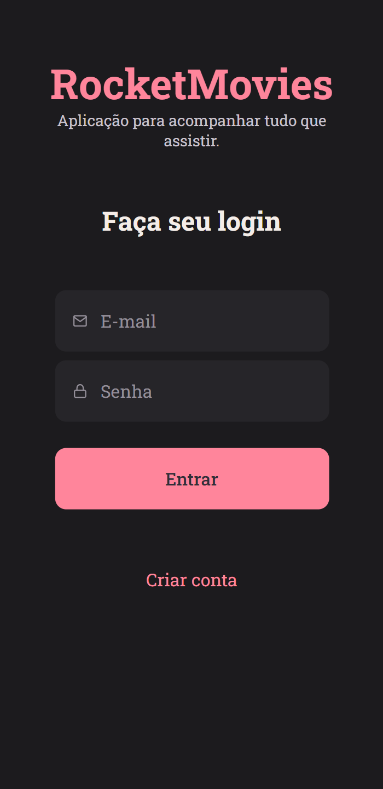
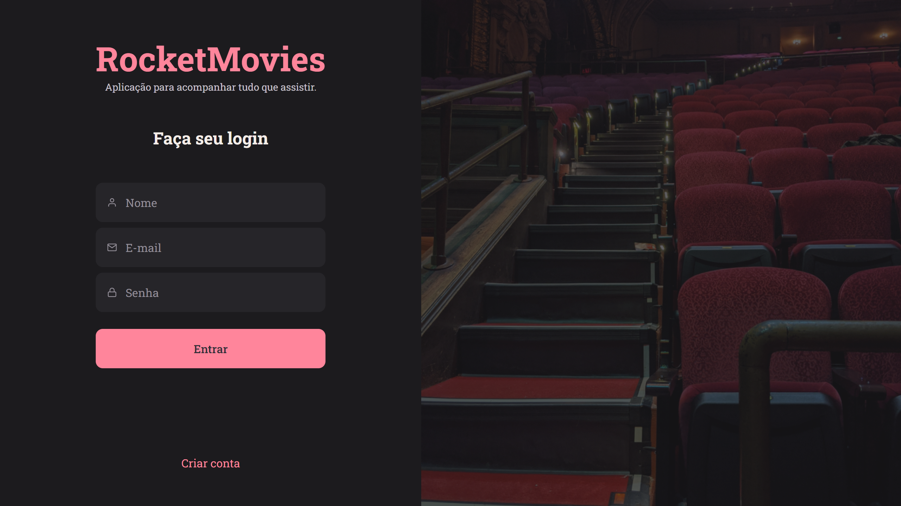

<h1 align="center"> RocketMovies  </h1>

The RocketMovies app is the capstone project for Rocketseat Explorer's program on module 10.  

  <a href="#live">Live</a>&nbsp;&nbsp;&nbsp;|&nbsp;&nbsp;&nbsp;
  <a href="#technologies">Technologies</a>&nbsp;&nbsp;&nbsp;|&nbsp;&nbsp;&nbsp;
  <a href="#layout">Layout</a>&nbsp;&nbsp;&nbsp;|&nbsp;&nbsp;&nbsp;
  <a href="#license">License</a>

  

<table>
  <tbody>
    <tr>
      <td>
        
      </td>
      <td>
        
      </td>
    </tr>
  </tbody>
</table>

<h2 id="live">👁️‍🗨️ Live</h2>

This project is hosted at Github Pages of this repository by the link <a href="https://leonardojacomussi.github.io/rocketmovies/" target="_blank">https://leonardojacomussi.github.io/rocketmovies/</a>

<h2 id="technologies">🚀 Technologies</h2>

This project was developed with the following technologies:

- React JS
- Typescript
- Styled Components
- Git and Github
- Figma

<h2 id="layout">🔖 Layout</h2>

You can view the project layout through [THIS LINK](https://www.figma.com/file/bhRb4iFUkfRFlDm9Yd5uk5/RocketMovies-(Copy)). You must have a [Figma](https://figma.com) account to access it.

<h2 id="license">📜 License</h2>

This project is under the MIT license.
